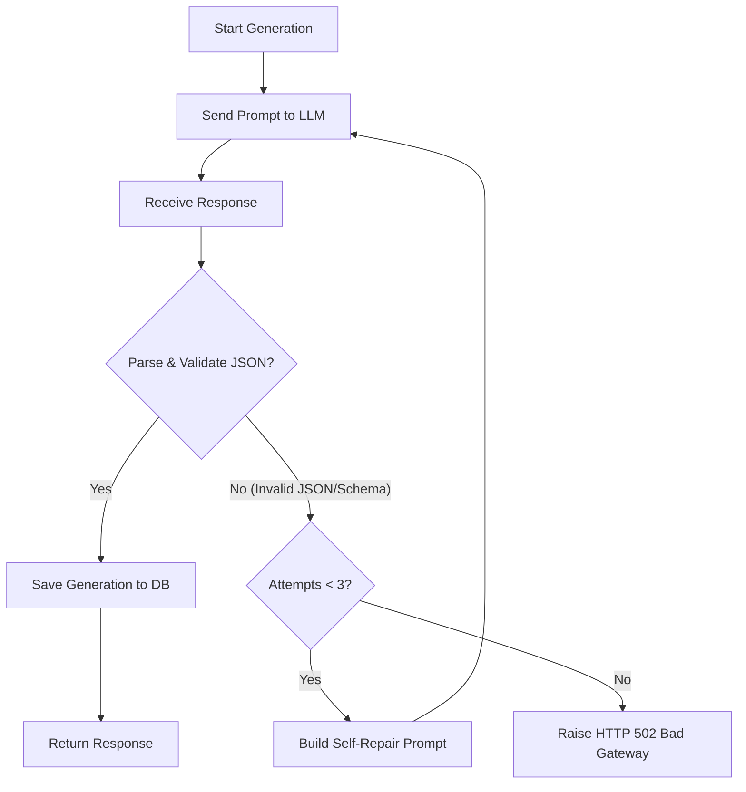

# LLM Prompt & Error Handling Design Document

> This document details the prompting strategy, structured output validation, self-repair loops, and duplicate submission policy for the test-case generation engine.

---

## 1. Prompt Design

The generation prompt is built dynamically to provide maximum context to the model while anchoring its generation strictly to the selected document nodes.

### Prompt Components
1. **Persona Anchor**: Instructs the model to act as a *high-integrity medical device software QA Engineer*, which sets a professional tone demanding precision, safety-oriented thinking, and strict adherence to specifications.
2. **Hierarchical Context Block**: Reconstructs the text content of the version-pinned nodes. Each node is separated and labeled with its ID, section number, and title.
3. **Traceability Constraints**: Explicitly restricts the model to choose from a list of valid node IDs for the `traceability_node_id` field.
4. **Strict JSON Schema**: Embeds the exact JSON structure required, instructing the model to return valid raw JSON *without* markdown wrapping (e.g. no \`\`\`json code blocks).

---

## 2. Structured Output Schema

The model is required to return a JSON object conforming to the `QAGenerationResponse` Pydantic model:

```json
{
  "test_cases": [
    {
      "id": "string",
      "name": "string",
      "description": "string",
      "expected_result": "string",
      "traceability_node_id": integer
    }
  ]
}
```

---

## 3. Failure & Self-Repair Retry Loop

"It usually works" is not a reliable architecture. To handle malformed, incomplete, or invalid LLM outputs, we implement a **self-correcting retry loop**:



### Self-Repair Prompting
When validation fails, we capture the exact exception details (e.g., `Missing required field: expected_result` or `Invalid JSON format`). We send this validation error back to the LLM as a `WARNING` along with its previous malformed response, instructing the model to rectify the error and output correct, clean JSON.

---

## 4. Duplicate Submission Policy

When a user requests test-case generation for a selection that has already been generated, we enforce the following caching and generation rules:

### Cached Retrieval (Default)
- By default, `POST /api/v1/selections/{selection_id}/generate` checks the `generations` table for any existing test cases generated for that specific selection.
- If found, it **returns the cached generation immediately** without calling the external LLM.
- **Justification**:
  1. **Cost Reduction**: Avoids repeated billing for expensive model calls.
  2. **Latency Reduction**: Returns results in a few milliseconds instead of waiting 2-5 seconds for LLM inference.
  3. **Consistency**: Prevents test cases from mutating randomly between requests.

### Forced Regeneration (Override)
- If the user explicitly sets the query parameter `force_regenerate=true`, the service bypasses the cache, invokes the LLM to generate a fresh set of test cases, and registers a new generation record in the database.
